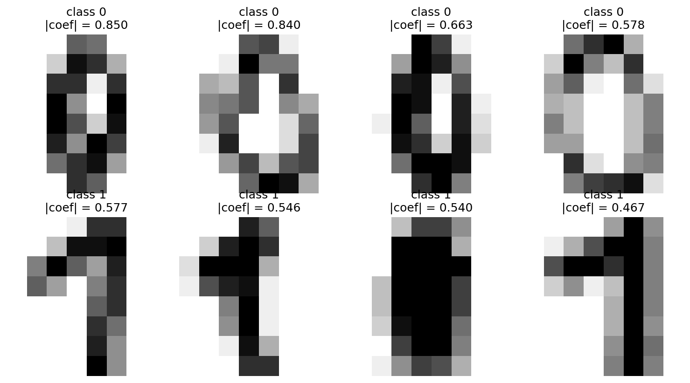

# Exercise 4c: Extracting and Visualizing Support Vectors

## Extraction

Scikit-learn stores all unique support vectors in `support_vectors_`, grouped
into consecutive class blocks. The size of each block is given by
`n_support_`. For the one-vs-one classifier that distinguishes class 0 from
class 1, row 0 of `dual_coef_` contains the coefficients for the class-0 and
class-1 blocks. A zero coefficient means that a globally stored support vector
is not used by this particular binary classifier.

```python
n_sv_per_class = svm.n_support_
block_starts = np.concatenate(([0], np.cumsum(n_sv_per_class)))
class0_positions = np.arange(block_starts[0], block_starts[1])
class1_positions = np.arange(block_starts[1], block_starts[2])

coef0 = svm.dual_coef_[0, class0_positions]
coef1 = svm.dual_coef_[0, class1_positions]
active0 = ~np.isclose(coef0, 0.0, atol=1e-12)
active1 = ~np.isclose(coef1, 0.0, atol=1e-12)

pair_positions0 = class0_positions[active0]
pair_positions1 = class1_positions[active1]
sv0 = svm.support_vectors_[pair_positions0]
sv1 = svm.support_vectors_[pair_positions1]
```

This extracts 23 active class-0 support vectors and 39 active class-1 support
vectors, giving 62 support vectors for the 0-vs-1 classifier.

## Influence Criterion

I ranked the vectors by the absolute magnitude of their pairwise dual
coefficient:

```python
magnitude0 = np.abs(coef0[active0])
magnitude1 = np.abs(coef1[active1])
top0 = np.argsort(-magnitude0, kind="stable")[:4]
top1 = np.argsort(-magnitude1, kind="stable")[:4]
```

The 0-vs-1 decision function is a weighted sum of RBF kernel similarities.
Therefore, a larger absolute dual coefficient gives a support vector more
weight in that decision function. The exact contribution for a particular
test image also depends on its RBF similarity to the support vector.

The selected coefficient magnitudes are:

| Rank | Class 0 | Class 1 |
|---:|---:|---:|
| 1 | 0.850000 | 0.576897 |
| 2 | 0.839842 | 0.546341 |
| 3 | 0.663203 | 0.540258 |
| 4 | 0.577888 | 0.467246 |

## Plot



## Interpretation

Theoretically, influential support vectors should be difficult or unusual
examples close to the boundary between the two classes. I therefore expected
less canonical digits: narrow or incomplete zeros, and ones that are thick,
slanted, off-center, or contain strokes that make them resemble another digit.

The plot mostly confirms this expectation. The selected zeros have uneven,
narrow, displaced, or almost rectangular loops rather than clean centered
ovals. The selected ones are thick or slanted and several have prominent
horizontal top strokes, making them look less like simple vertical lines and
more like sevens. One class-1 example is relatively bold and recognizable,
which is a useful reminder that visual ambiguity alone does not determine
influence in an RBF SVM: local similarity to other training samples and the
soft-margin optimization also affect the learned coefficient.
